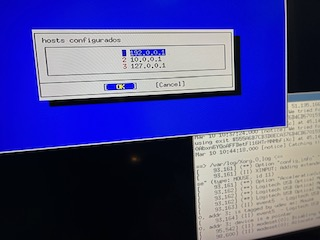

<!-- PROJETOS -->
## Projetos

### Pamtool

Use this space to show useful examples of how a project can be used. Additional screenshots, code examples and demos work well in this space. You may also link to more resources.

_For more examples, please refer to the [Documentation](https://example.com)_

<!-- CONTATO -->
## Contato

Se preferir enviar-nos um e-mail, o formato &eacute; bastante r&iacute;gido, por favor use este modelo. Envie-o para contato em rekall.com.br, com uma linha Assunto: contendo a palavra "contato".

De outra forma pode entrar em contato pelo linkedin abaixo:

[![Bootstrap][Bootstrap.com]][Bootstrap-url] [![JQuery][JQuery.com]][JQuery-url] [![LinkedIn][linkedin-shield]][linkedin-url]

<!-- MARKDOWN LINKS & IMAGES -->
[Bootstrap.com]: https://img.shields.io/badge/Bootstrap-563D7C?style=for-the-badge&logo=bootstrap&logoColor=white
[Bootstrap-url]: https://getbootstrap.com
[JQuery.com]: https://img.shields.io/badge/jQuery-0769AD?style=for-the-badge&logo=jquery&logoColor=white
[JQuery-url]: https://jquery.com
[linkedin-shield]: https://img.shields.io/badge/-LinkedIn-black.svg?style=for-the-badge&logo=linkedin&colorB=555
[linkedin-url]: https://www.linkedin.com/in/d-a-oliveira-filho/
<!-- https://www.markdownguide.org/basic-syntax/#reference-style-links -->
